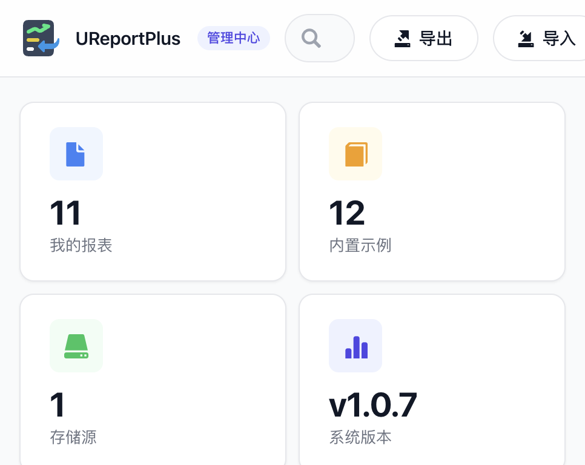
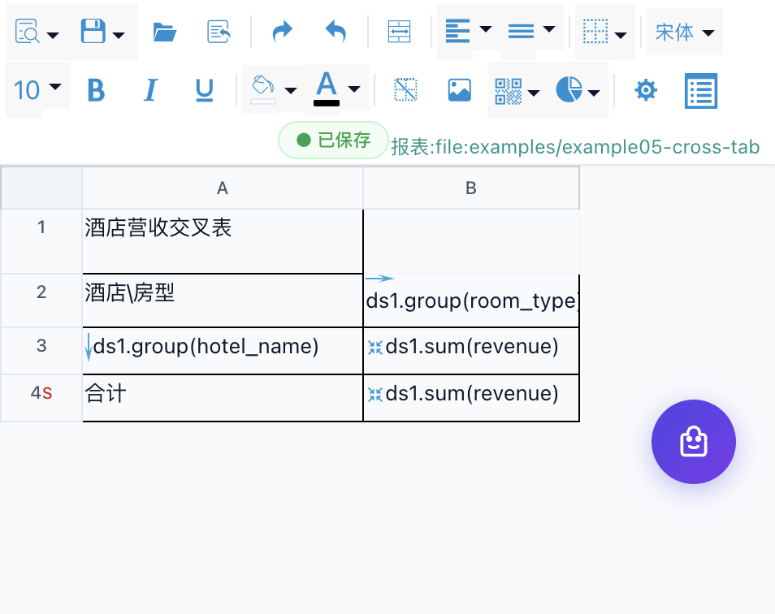
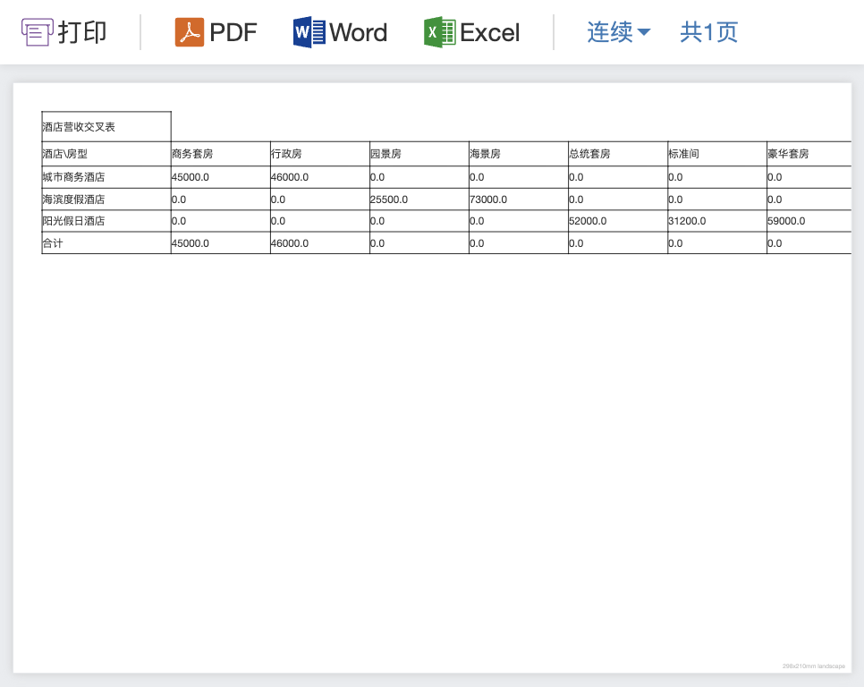

<p align="center">
  
</p>

<h1 align="center">UReportPlus</h1>

<p align="center">
  <strong>高性能纯 Java 中式报表引擎</strong>
  <br/>
  可视化 Web 设计器 · 多格式导出 · 开源免费
</p>

<p align="center">
  🇨🇳 中文 &nbsp;|&nbsp; <a href="README.md">🇬🇧 English</a>
</p>

<p align="center">
  <a href="https://www.apache.org/licenses/LICENSE-2.0"></a>
  <a href="https://central.sonatype.com/artifact/com.kingint.ureportplus/ureportplus-console"></a>
  <a href="#"></a>
  <a href="https://gitee.com/lg10/ureport-plus"></a>
</p>

---

## 📖 目录

- [项目简介](#-项目简介)
- [界面预览](#-界面预览)
- [集成指南](#-集成指南)
- [功能特性](#-功能特性)
- [快速开始](#-快速开始)
- [配置参考](#-配置参考)
- [深入文档](#-深入文档)
- [扩展开发 SPI](#-扩展开发-spi)
- [版本历史](#-版本历史)
- [常见问题](#-常见问题)

---

## 📌 项目简介

**UReportPlus** 是一款新一代中式报表引擎，完全基于 Java 和 Spring 构建，继承并升级了 UReport2 的设计理念。你可以在浏览器中完成从报表设计、数据绑定、预览到导出的全部流程——**零代码，全可视化**。

### 为什么选择 UReportPlus？

| 对比维度 | 传统报表工具 | UReportPlus |
| :--- | :--- | :--- |
| 部署方式 | 独立服务器，资源重 | **嵌入式 JAR**，随应用启动 |
| 报表设计 | 桌面客户端，需安装 | **浏览器可视化**，打开即用 |
| 开源协议 | 商业授权或 GPL 传染 | **Apache 2.0** 完全开放 |
| 扩展能力 | 插件受限，黑盒 | **SPI 接口**，存储/权限/图片全可定制 |
| 表达式 | 私有语法，学习成本高 | **ANTLR4 标准解析**，类 JavaScript 语法 |
| 二次开发 | 需要商业授权 | **纯 Java 源码**，可深度定制 |

### 适用场景

- 🏨 **酒店行业**：日营收报表、月度汇总、年度对比分析
- 🏭 **制造业**：生产日报、质检报告、工序统计
- 💰 **财务报表**：利润表、资产负债表、现金流量表
- 📊 **数据分析**：交叉表、分组汇总、同比环比
- 🧾 **票据打印**：发票、收据、凭证（PDF 精确排版）
- 🏢 **政务系统**：公示表格、统计年鉴、普查报告

---

## 📸 界面预览

| 报表管理中心 | 可视化设计器 |
| :---: | :---: |
|  |  |

<p align="center">
  
  <br/>
  <sub>在浏览器中设计的报表，HTML 在线预览效果</sub>
</p>

---

## 🔧 集成指南

### Maven 依赖

```xml
<!-- 推荐：控制台模块，Maven 自动解析传递依赖 -->
<dependency>
    <groupId>com.kingint.ureportplus</groupId>
    <artifactId>ureportplus-console</artifactId>
    <version>1.0.7</version>
</dependency>
```

```xml
<!-- 备选：Fat JAR（全部依赖打入一个包，约 80MB） -->
<dependency>
    <groupId>com.kingint.ureportplus</groupId>
    <artifactId>ureportplus-all</artifactId>
    <version>1.0.7</version>
</dependency>
```

| 模块 | 适用场景 |
| :--- | :--- |
| `ureportplus-console` | **生产环境推荐**。精确控制依赖版本，避免冲突 |
| `ureportplus-all` | 快速原型 / 依赖冲突难以解决时使用 |

> 最新版本号以顶部 Maven Central 徽章为准（实时同步中央仓库）。

### Gradle 依赖

```groovy
implementation 'com.kingint.ureportplus:ureportplus-console:1.0.7'
```

### Spring Boot 集成（推荐）

适用于 Spring Boot 2.x（基于 javax.servlet，Spring Boot 3.x 兼容性见[常见问题](#-常见问题)）。

```java
package com.example;

import com.kingint.ureportplus.console.UReportPlusServlet;
import org.springframework.boot.SpringApplication;
import org.springframework.boot.autoconfigure.SpringBootApplication;
import org.springframework.boot.web.servlet.ServletRegistrationBean;
import org.springframework.context.annotation.Bean;
import org.springframework.context.annotation.ImportResource;

@SpringBootApplication
@ImportResource("classpath:ureportplus-console-context.xml")
public class ReportApplication {

    public static void main(String[] args) {
        SpringApplication.run(ReportApplication.class, args);
    }

    @Bean
    public ServletRegistrationBean<UReportPlusServlet> ureportServlet() {
        ServletRegistrationBean<UReportPlusServlet> reg =
            new ServletRegistrationBean<>(
                new UReportPlusServlet(), "/ureport/*"
            );
        reg.setLoadOnStartup(1);
        return reg;
    }
}
```

```properties
# application.properties — 最小配置
ureportplus.fileStoreDir=/opt/reports
```

> ⚠️ **重要**：URL Pattern 必须为 `/ureport/*`，不可修改。这是框架内部路由的硬编码前缀。

### 传统 web.xml 配置

```xml
<!-- Servlet 配置 -->
<servlet>
    <servlet-name>ureportplusServlet</servlet-name>
    <servlet-class>com.kingint.ureportplus.console.UReportPlusServlet</servlet-class>
</servlet>
<servlet-mapping>
    <servlet-name>ureportplusServlet</servlet-name>
    <url-pattern>/ureport/*</url-pattern>
</servlet-mapping>
```

**项目未使用 Spring 的情况下**：

```xml
<listener>
    <listener-class>org.springframework.web.context.ContextLoaderListener</listener-class>
</listener>
<context-param>
    <param-name>contextConfigLocation</param-name>
    <param-value>classpath:ureportplus-console-context.xml</param-value>
</context-param>
```

**项目已使用 Spring 的情况下**，在已有配置中导入：

```xml
<import resource="classpath:ureportplus-console-context.xml"/>
```

---

## ✨ 功能特性

### 🎨 可视化报表设计器

基于 Handsontable 电子表格组件打造的 Web 设计器，类 Excel 操作体验。支持：

- 合并/拆分单元格、斜线表头
- 条件样式（根据数据动态变色）
- 字体、字号、颜色、边框、对齐、背景色
- 行高/列宽拖拽调整、插入/删除行列
- **100 步撤销/重做**
- 导出 Excel 模板 → 填写数据 → 导入生成报表

### 📊 中式复杂报表

原生支持中国式复杂报表的所有典型需求：

| 报表类型 | 说明 |
| :--- | :--- |
| 分组报表 | 按字段纵向/横向分组，支持多级嵌套 |
| 交叉报表 | 行维度 × 列维度，自动计算交叉点数据 |
| 明细报表 | 逐行展示数据，支持分页 |
| 分片报表 | 纵向+横向同时分组，适合多维分析 |
| 主子报表 | 父格-子格依赖树，自动迭代展开 |

### 📤 多格式导出

| 格式 | 技术 | 特性 |
| :--- | :--- | :--- |
| **PDF** | iText 5.5 | 精确排版、内嵌中文字体、支持打印 |
| **Excel** | Apache POI 3 | 支持 .xlsx 和 .xls 格式、分页分 Sheet |
| **Word** | Apache POI XWPF | .docx 格式，可继续编辑 |
| **HTML** | 服务端渲染 | 在线预览，支持条件样式和图表 |

### 🧮 表达式引擎

ANTLR4 驱动的自研 DSL，类 JavaScript 语法：

```javascript
// 计算税额
ds.sum(revenue) * 0.13

// 条件判断
A1 > 1000 ? "超标" : "正常"

// 多条件分支
if (A1 > 10000) { return "优秀" }
else if (A1 > 5000) { return "良好" }
else { return "一般" }

// 中文大写金额
chnMoney(ds.sum(revenue))
```

### 📈 图表与条码

- **10 种图表**：柱状图、折线图、饼图、面积图、环形图、雷达图、极坐标图、散点图、气泡图、混合图
- **条码/二维码**：ZXing 库生成，可嵌入报表单元格

### 🔌 扩展机制 (SPI)

全部通过 Spring Bean 注入，无需修改源码：

- **ReportProvider** — 报表存储（本地/数据库/OSS/S3/MinIO）
- **ImageProvider** — 图片加载（本地/HTTP/HTTPS/数据库BLOB）
- **ReportAuthCheck** — 权限校验（集成企业LDAP/OAuth/SSO）

### 更多特性

- 🤖 **AI 智能助手**：自然语言描述需求 → 自动生成报表（支持 OpenAI 兼容接口）
- 📐 **查询表单设计器**：可视化设计参数查询表单
- 🔐 **控制台认证**：支持登录保护，可接入企业权限系统
- 🚀 **生产安全**：可禁用设计器入口，仅保留预览和导出
- 📦 **Fat JAR**：提供 All-in-One 包，零依赖集成

---

## 🚀 快速开始

### 环境要求

- JDK 1.7 及以上（推荐 JDK 8）
- Maven 3.0 及以上
- 现代浏览器（Chrome / Firefox / Edge）

### 方式一：集成到你的应用（最快）

1. 创建一个 Spring Boot 2.x 应用，按[集成指南](#-集成指南)添加 Maven 依赖；
2. 使用上面的配置类注册 Servlet（约 10 行代码）；
3. 启动应用，打开 **http://localhost:8080/ureport/designer** 🎉

### 方式二：源码编译

```bash
# 1. 克隆项目
git clone https://gitee.com/lg10/ureport-plus.git
cd ureport-plus

# 2. 依次构建全部模块到本地仓库
for m in ureportplus-parent ureportplus-core ureportplus-font ureportplus-console ureportplus-all; do
  mvn -f "$m/pom.xml" clean install -DskipTests
done
```

构建完成后，将 `ureportplus-console` 构件按方式一集成到你的应用中即可。

---

## ⚙️ 配置参考

### 核心配置

| 属性 | 类型 | 默认值 | 说明 |
| :--- | :--- | :--- | :--- |
| `ureportplus.fileStoreDir` | String | `ureportfiles/` | 报表文件存储目录，生产环境建议使用绝对路径 |
| `ureportplus.disableFileProvider` | boolean | `false` | 设为 `true` 禁用文件系统存储 |
| `ureportplus.disableHttpSessionReportCache` | boolean | `false` | 禁用 Session 级报表缓存 |
| `ureportplus.debug` | boolean | `false` | 调试模式：详细日志，禁用所有缓存 |
| `ureportplus.disableDesigner` | boolean | `false` | **生产环境建议开启**，关闭设计器入口 |

### AI 助手配置

| 属性 | 类型 | 默认值 | 说明 |
| :--- | :--- | :--- | :--- |
| `ureportplus.ai.enabled` | boolean | `false` | 启用 AI 报表生成功能 |
| `ureportplus.ai.provider` | String | `openai` | AI 服务提供商 |
| `ureportplus.ai.api-key` | String | — | API 密钥 |
| `ureportplus.ai.api-url` | String | `https://api.openai.com/v1` | API 端点 |
| `ureportplus.ai.model` | String | `gpt-4o` | 模型名称 |
| `ureportplus.ai.max-tokens` | int | `4096` | 单次最大 Token 数 |
| `ureportplus.ai.temperature` | double | `0.3` | 生成温度 (0-2) |
| `ureportplus.ai.max-retries` | int | `2` | 失败重试次数 |

### 控制台认证

| 属性 | 类型 | 默认值 | 说明 |
| :--- | :--- | :--- | :--- |
| `ureportplus.console.username` | String | — | 设置后自动启用控制台登录 |
| `ureportplus.console.password` | String | — | 登录密码 |

---

## 📚 深入文档

详细参考文档位于 [`docs/`](docs/) 目录：

| 主题 | 文档 |
| :--- | :--- |
| 🧮 表达式语言：语法、单元格引用、条件判断与 40+ 内置函数 | [EXPRESSION-LANGUAGE.md](docs/EXPRESSION-LANGUAGE.md) |
| 📄 报表 XML 格式：完整 `.ureportplus.xml` 示例与单元格属性 | [REPORT-XML.md](docs/REPORT-XML.md) |
| 🌐 URL 接口参考：设计器、预览、导出与 API 端点 | [URL-REFERENCE.md](docs/URL-REFERENCE.md) |
| 🏗 系统架构与技术栈：模块结构、报表生命周期、依赖清单 | [ARCHITECTURE.md](docs/ARCHITECTURE.md) |

---

## 🔌 扩展开发 SPI

### ReportProvider — 自定义报表存储

```java
public interface ReportProvider {
    InputStream loadReport(String file);
    void saveReport(String file, String content);
    void deleteReport(String file);
    List<ReportFile> getReportFiles();
    String getName();       // 显示名称
    String getPrefix();     // URL 前缀
    boolean disabled();
}
```

**示例：MySQL 数据库存储**

```java
@Component
public class MysqlReportProvider implements ReportProvider {
    @Autowired
    private JdbcTemplate jdbcTemplate;

    @Override
    public InputStream loadReport(String file) {
        String content = jdbcTemplate.queryForObject(
            "SELECT content FROM ureport_reports WHERE name = ?",
            String.class, file);
        return new ByteArrayInputStream(
            content.getBytes(StandardCharsets.UTF_8));
    }

    @Override
    public void saveReport(String file, String content) {
        jdbcTemplate.update(
            "INSERT INTO ureport_reports (name, content) VALUES (?, ?) " +
            "ON DUPLICATE KEY UPDATE content = ?",
            file, content, content);
    }
    // ... 其余方法
}
```

实现接口并注册为 Spring Bean 即刻生效。

### ImageProvider — 自定义图片源

```java
public interface ImageProvider {
    InputStream getImage(String path);
    boolean support(String path);
}
```

### ReportAuthCheck — 权限校验

```java
public interface ReportAuthCheck {
    boolean isPermitted(String action, String reportFile);
}
```

`action` 取值：`designer`、`preview`、`pdf`、`excel`、`excel97`、`word`、`delete`、`save`

---

## 📋 版本历史

最新版本：**v1.0.7** (2026-08-29) —— 完整发布记录见 [VERSION_HISTORY-zh_CN.md](VERSION_HISTORY-zh_CN.md)。

---

## ❓ 常见问题

<details>
<summary><b>能修改 /ureport 路径吗？</b></summary>

不能。`/ureport/*` 是框架内部路由的硬编码前缀，不可修改。
</details>

<details>
<summary><b>Spring Boot 3.x 能用吗？</b></summary>

有限兼容。引擎基于 javax.servlet，Spring Boot 3.x 使用 Jakarta EE。建议使用 `ureportplus-all` 减少冲突，或等待 Jakarta 迁移版本。
</details>

<details>
<summary><b>报表能存数据库吗？</b></summary>

可以。实现 `ReportProvider` SPI，读写数据库。参见上方 SPI 示例代码。
</details>

<details>
<summary><b>如何禁用设计器？</b></summary>

```properties
ureportplus.disableDesigner=true
```
</details>

<details>
<summary><b>密码如何加密？</b></summary>

使用 Jasypt 等方案包装 `ureportplus.properties` 中的敏感值。
</details>

<details>
<summary><b>支持 IE 吗？</b></summary>

不支持。请使用 Chrome、Firefox、Edge。
</details>

---

## 📎 相关资源

| 文档 | 链接 |
| :--- | :--- |
| 📖 English README | [README.md](README.md) |
| 📋 版本历史 | [VERSION_HISTORY-zh_CN.md](VERSION_HISTORY-zh_CN.md) |
| 🧮 表达式语言与内置函数 | [docs/EXPRESSION-LANGUAGE.md](docs/EXPRESSION-LANGUAGE.md) |
| 📄 报表 XML 格式 | [docs/REPORT-XML.md](docs/REPORT-XML.md) |
| 🌐 URL 接口参考 | [docs/URL-REFERENCE.md](docs/URL-REFERENCE.md) |
| 🏗 系统架构与技术栈 | [docs/ARCHITECTURE.md](docs/ARCHITECTURE.md) |
| 💾 存储与数据源配置 | [docs/STORAGE-DATASOURCE.md](docs/STORAGE-DATASOURCE.md) |
| 🧮 报表计算模型 | [docs/REPORT-MODEL.md](docs/REPORT-MODEL.md) |
| 📝 UReport2 2.x 更新日志（2017 年存档） | [CHANGELOG.md](CHANGELOG.md) |

---

## 🤝 参与贡献

1. 🍴 Fork 本仓库
2. 🌿 创建分支：`git checkout -b feature/xxx`
3. ✏️ 提交更改：`git commit -m 'feat: xxx'`
4. 📤 推送分支：`git push origin feature/xxx`
5. 🔀 提交 Pull Request 到 `develop` 分支

---

## 📄 开源协议

[Apache License 2.0](http://www.apache.org/licenses/LICENSE-2.0) · Copyright © 2017-2026 **KinginT**

Powered by [Gitee](https://gitee.com/lg10/ureport-plus)
